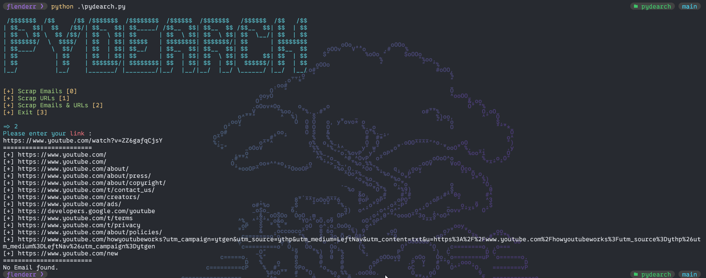

# 🔍 PyDearch 🔍

## Description

PyDearch is a Python script designed to scrape email addresses and URLs from a given webpage. It uses requests to fetch the webpage content, BeautifulSoup for parsing HTML, and re for regular expressions to find email addresses. The script provides a user-friendly menu to choose between scraping emails, URLs, or both.

## Features

- Scrape **email addresses** from a webpage.
- Scrape all **URLs** from a webpage.
- Scrape both **email addresses** and **URLs** from a webpage.
- User-friendly menu for easy navigation.

## Installation

1. **Clone the Repository**:
    ```sh
    git clone https://github.com/FlenderrAX/pydearch.git
    cd pydearch
    ```

2. **Create a Virtual Environment**:
    ```sh
    python3 -m venv env
    source env/bin/activate  # On Windows, use `env\Scripts\activate`
    ```

3. **Install Dependencies**:
    ```sh
    pip install -r requirements.txt
    ```

## Example



## Contributing

Contributions are welcome! Please fork this repository, make your changes, and submit a pull request.

## License

This project is licensed under the MIT License. See the [LICENSE](LICENSE) file for details.

## Contact

If you have any questions or suggestions, feel free to open an issue.